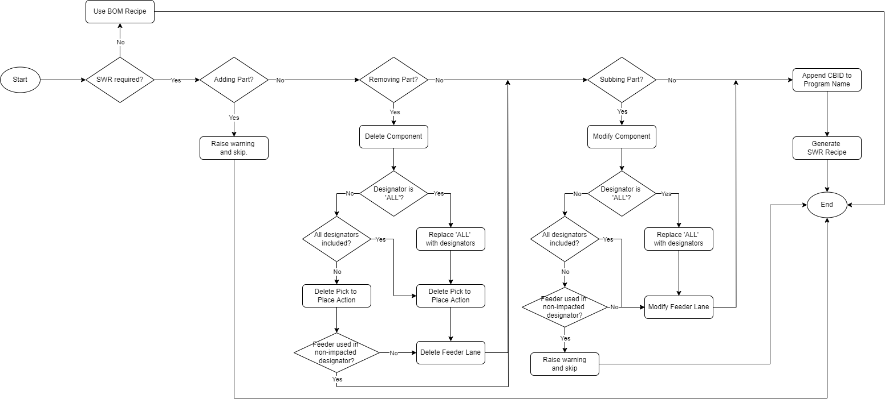

# SWR_PROGRAM_CREATE
To automate SWR program creation, generated based on bom programs. Developed by [jiajunlee](https://github.com/jiajunlee19).

 

There are generally 3 types of SWR, see limitations in below section.
1. `SWR Part Extra Place` or `Adding Part` (Low demand - ~10%)
2. `SWR Part No Place` or `Removing Part` (Low demand - ~10%)
3. `SWR Part Number/Suffix Sub` or `Subbing Part` (High demand ~80%)

 

### Installation
- Fork this project [here](https://github.com/jiajunlee19/swr-program-create-app/fork)
  
    OR
   
- Clone this project by `git clone "https://github.com/jiajunlee19/swr-program-create-app.git"`
  
    OR
   
- Download this project in zip [here](https://github.com/jiajunlee19/swr-program-create-app/archive/refs/heads/master.zip) and extract

 

### How to run?
0. (Optional) Go to `settings` sheet in [BOM.xlsx](BOM.xlsx), modify the settings if needed.
1. Go to `SWR` sheet in [SWR.xlsx](SWR.xlsx), fill in all SWR requirements accordingly.
2. Place all relevant bom recipes in [recipe-bom](recipe-bom/) folder.
3. Run [main.exe](main.exe).
4. Created SWR recipes can be found in [recipe-swr](recipe-swr/) folder within subfolder grouped by `CBID`.
5. (Optional): View the logs in [Log/SWR_PROGRAM_CREATE.log](Log/SWR_PROGRAM_CREATE.log).

 

### Limitations
Below are the limitations that cannot be handled. Warning will be raised as such the impacted CBID will be skipped.
1. `SWR Part Extra Place` or `Adding Part` cannot be handled.
2. `SWR Part Sub` or `Subbing Part` with feeder used in any non-impacted designator cannot be handled.

 

### Test Cases
Below are the passing test cases, using master bom recipes in [recipe-bom/590-123456/](recipe-bom/590-123456/).

| SWR Requirements                     | Generated SWR recipes                                                          |
| :---                                 | :-------------------------                                                     |
| [123456-EXTRAPLACE](SWR.xlsx)        | No SWR recipes generated as per limitation `#1`                                |
| [123457-NOPLACE-ALL](SWR.xlsx)       | [All imapcted parts and feeders are removed](recipe-swr/123457-NOPLACE-ALL/)   |
| [123458-NOPLACE-Partial](SWR.xlsx)   | [All impacted parts are removed, keeping feeders for non-impacted designators ](recipe-swr/123458-NOPLACE-PARTIAL/) |
| [123459-PARTSUB-ALL](SWR.xlsx)       | [All impated parts and feeders are subbed](recipe-swr/123459-PARTSUB-ALL/)     |
| [123460-PARTSUB-PARTIAL](SWR.xlsx)   | No SWR recipes generated as per limitation `#2`                                |

 

### Details
Here are some details if you are interested on how the `.pp` or `.pp7` are modified and being generated into `recipe-bom-new`.

0. SWR requirement
     
    
     
    

 

1. Part Removal - Delete Component
     
    

 

2. Part Removal - Delete Feeder
     
    

 

3. Part Removal - Delete Pick to Place
    * For pp
         
        
         
    * For pp7
         
        

 

4. Part Sub - Modify Component
     
    

 

5. Part Sub - Modify Feeder
     
    

 

6. Generate SWR Recipe
     
    

 